# 1.项目介绍
- 系统角色：管理员、普通用户、回收员
- 功能模块：管理员（用户管理、回收员管理、垃圾类型管理、商品分类管理、环保商城管理、上门回收管理、订单分配管理、订单管理、系统管理等）、回收员（订单分配、订单管理等）、普通用户（上门回收、订单分配、订单查看）
- 技术栈:SpringBoot、vue等，其他第三方查看pom.xml文件
- 测试环境：idea2024，maven3，mysql5.7，jdk1.8等
# 2.项目部署
- 创建数据库，导入sql
- 通过idea打开项目，根据本地数据库环境配置 src/main/resources/application.yml 12-15行
- 启动项目（vue项目已经放到src/main/resources下，测试直接使用编译后的文件，在dist下，你可以通过vscode或者webstorm打开Vue项目修改后自行编译）
- 后端管理web：http://localhost:8080/springboot67feo/admin/dist/index.html  管理员账号密码：admin/admin，其他角色自行查看表
- 前端：http://localhost:8080/springboot67feo/front/dist/index.html
# 3.项目部分截图
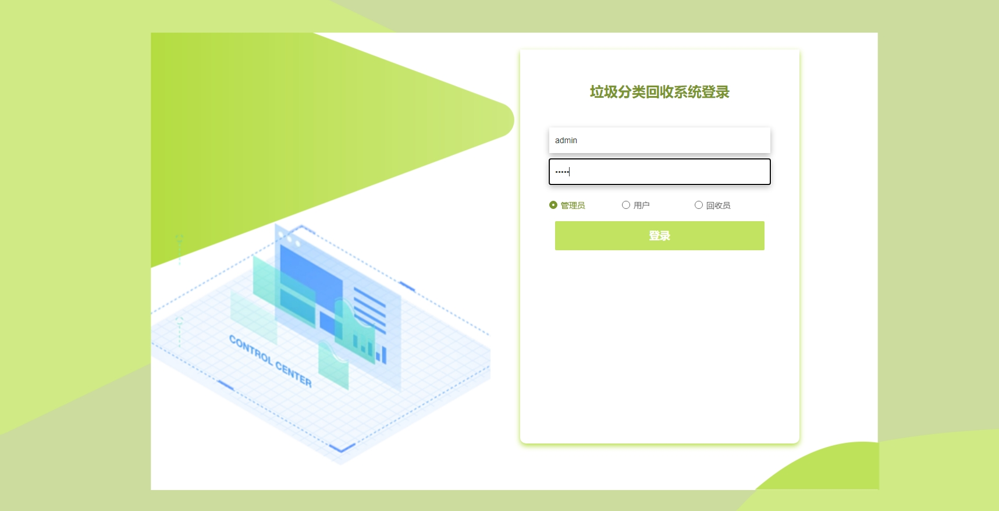
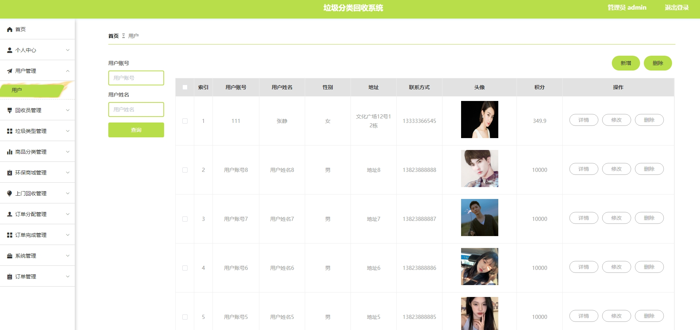
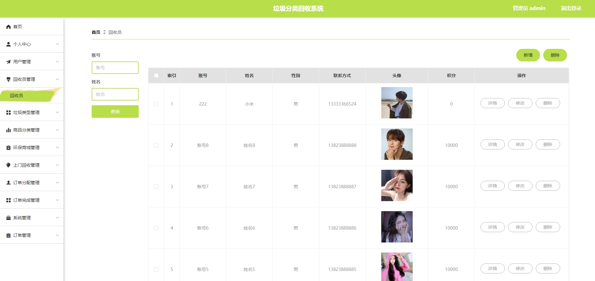
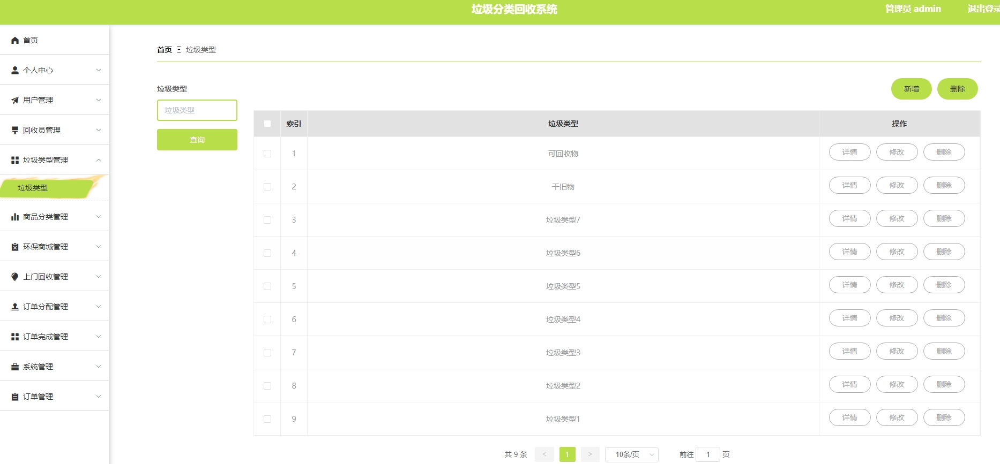
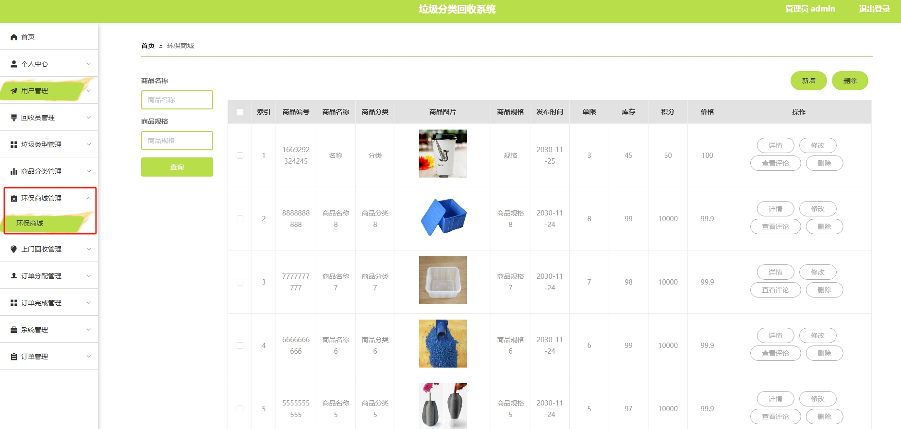
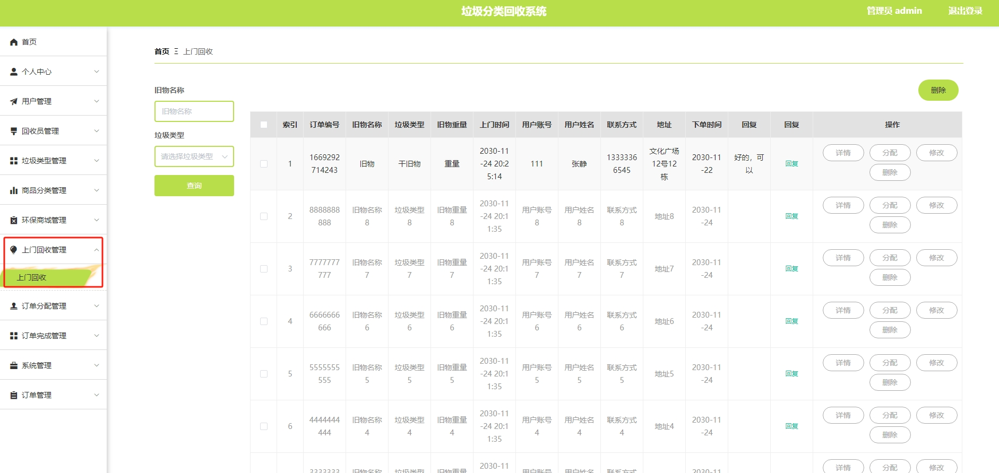
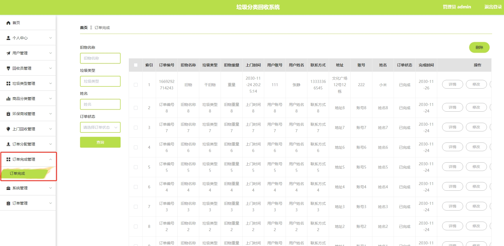

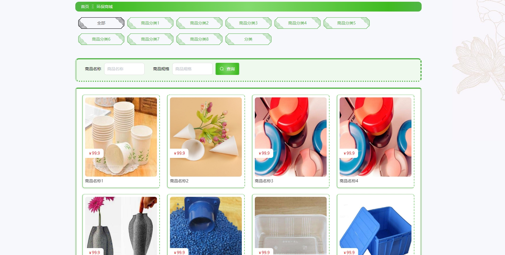
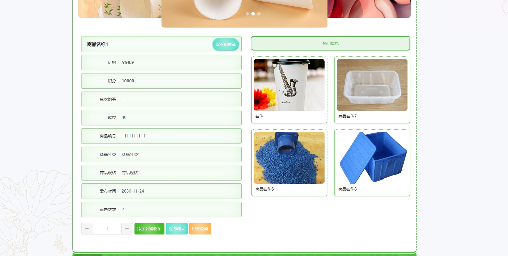
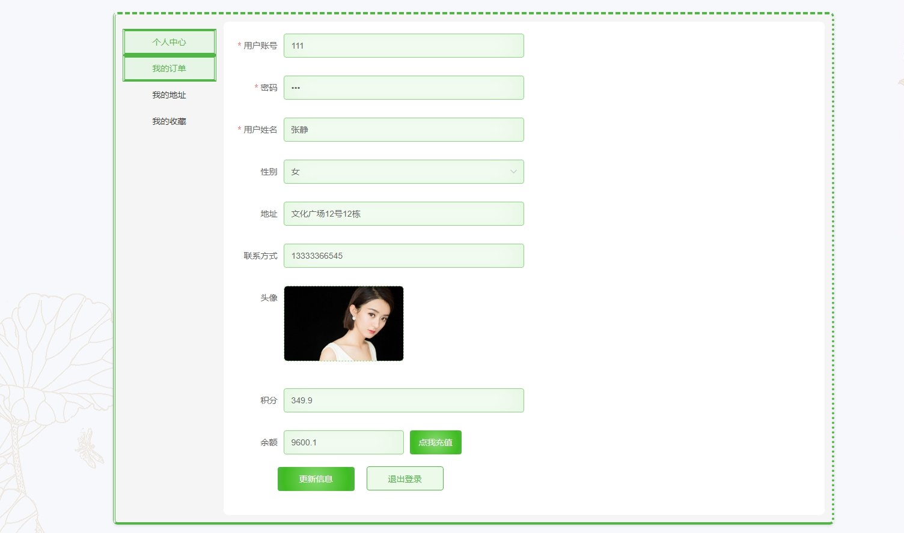
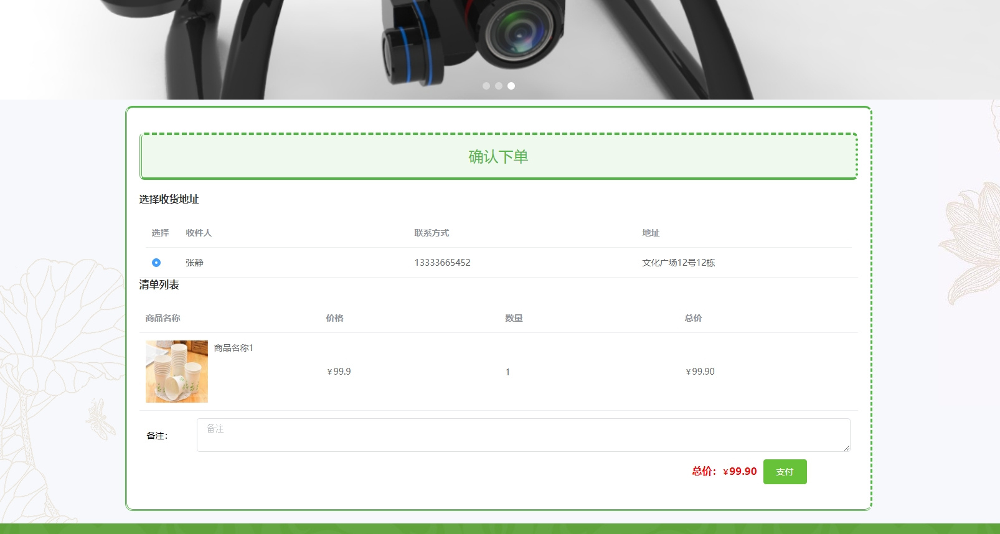
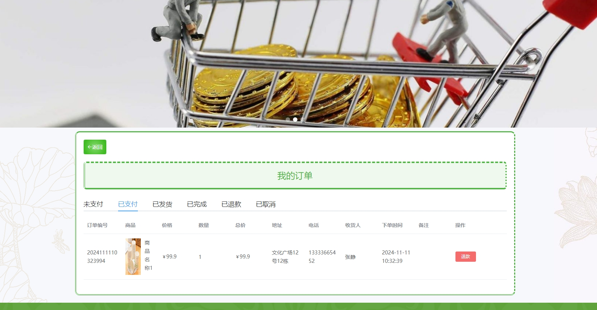

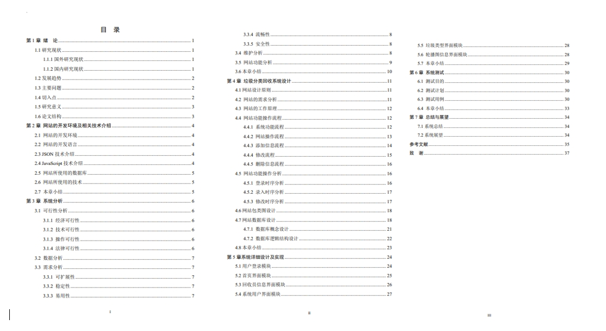

# 4.获取方式
[戳我查看](https://gitee.com/aven999/mall)